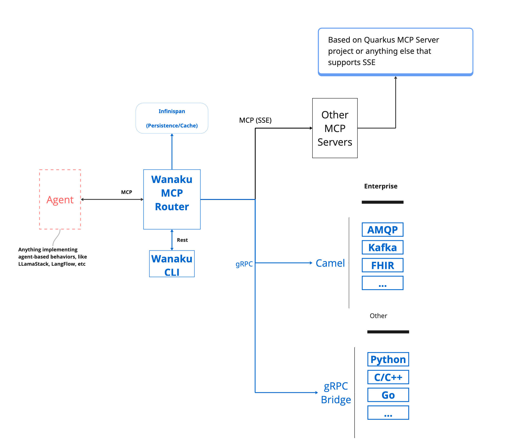

# Wanaku MCP Router Components and Architecture

## Overview

The Wanaku MCP Router is a powerful tool for managing Model Context Protocol (MCP) workloads, providing a flexible and extensible
framework for integrating with various servers and tools. Wanaku doesn't directly host tools or resources, instead, 
it acts as a central hub that manages and governs how agents access specific resources. Different types of tools and 
resources can be provided by Wanaku, as long as a capability service is linked with the router.

> [NOTE]
> For detailed information about the router's internal implementation, see [Wanaku Router Internals](wanaku-router-internals.md).

## Components

The Wanaku MCP Router is composed of the following components:

### Core Router Components

* **Router Backend** (`wanaku-router-backend`) - The main MCP server engine that receives MCP requests and forwards them to appropriate providers or services using gRPC
* **Router Web** (`wanaku-router-web`) - Web interface for managing and monitoring the router
* **CLI** (`cli`) - Command-line interface for router configuration and management

### Resource Providers

Resource providers enable access to different data sources and storage systems. 

### Tool Services

Tool services provide LLM-callable capabilities through the MCP protocol:

* **Exec Tool Service** (`wanaku-tool-service-exec`) - Execute system commands and processes
* **HTTP Tool Service** (`wanaku-tool-service-http`) - Make HTTP requests to REST APIs and web services
* **Tavily Tool Service** (`wanaku-tool-service-tavily`) - Search integration through Tavily API

### Core Libraries

* **API** (`api`) - Common API definitions and data models
* **Core Exchange** (`core-exchange`) - gRPC protocols and message exchange definitions
* **Core MCP** (`core-mcp`) - MCP protocol implementation and client libraries
* **Core Capabilities Base** (`core-capabilities-base`) - Base classes for capability implementations
* **Core Security** (`core-security`) - Security framework and authentication
* **Core Service Discovery** (`core-service-discovery`) - Service registration and discovery mechanisms
* **Core Persistence** (`core-persistence`) - Data persistence abstractions with Infinispan implementation

### Development and Extension Tools

* **Archetypes** (`archetypes`) - Maven archetypes for creating new providers and tool services
* **MCP Servers** (`mcp-servers`) - Additional specialized MCP server implementations
* **UI** (`ui`) - React-based web interface for router management

## Architecture Overview

The Wanaku MCP Router follows a distributed microservices architecture where the central router coordinates with independent provider and tool services:

### Request Flow

1. **LLM Client** connects to the router backend via MCP protocol
2. **Router Backend** receives MCP requests (resource reads, tool calls)
3. **Proxy Layer** determines the appropriate service based on resource/tool type
4. **gRPC Communication** forwards requests to specific provider or tool services
5. **Service Processing** handles the actual resource access or tool execution
6. **Response Aggregation** results are returned through the proxy layer back to the client

### Service Discovery and Registry

The router maintains a service registry that tracks available providers and tool services. Services register themselves with the router, enabling dynamic capability discovery and load balancing.

### Security and Configuration

* **Provisioning System** - Dynamic configuration and secret management
* **Authentication** - Secure service-to-service communication
* **Isolation** - Each provider/tool service runs independently for security and reliability

### Extensibility

New capabilities can be added by:
* Creating new provider services for additional resource types
* Developing tool services for new integrations
* Using provided Maven archetypes for rapid development
* Leveraging Apache Camel's 300+ components for tool services