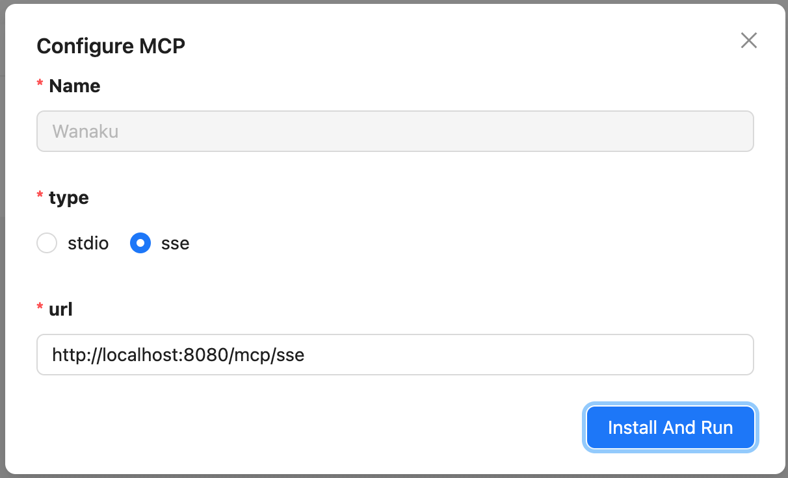

# Client Integration

This guide covers how to integrate Wanaku with various MCP clients, including Claude Desktop, HyperChat, LibreChat, and others.

## Overview

Wanaku implements the MCP protocol and, by definition, should support any client that is compliant to the protocol.

The details below describe how Wanaku MCP router can be used with some prominent MCP clients.

## Embedded LLMChat for Testing

Wanaku Console includes simple LLMChat specifically designed for quick testing of the tools.

> [!NOTE]
> At the moment, the Embedded LLMChat supports only the tools.

```shell
open http://localhost:8080
```


To use the embedded LLMChat:

1. Setup LLM - `baseurl`, `api key`, `model`, and extra parameters
2. Select tools
3. Enter prompt and send

## Claude Desktop

To integrate Wanaku with Claude Desktop, you will need to add an entry into the `claude_desktop_config.json` file - see [instructions for creating a Claude desktop configuration](https://modelcontextprotocol.io/quickstart/user) if you do not already have one.

Claude Desktop does not currently support connecting to SSE-based endpoints, so you will have to configure wanaku using a stdio-to-sse wrapper. Note that you will have to install [uv](https://github.com/astral-sh/uv) for this purpose, and specify the SSE URL for your Wanaku instance in the arguments.

```json
{
  "mcpServers": {
    "wanaku": {
        "command": "uvx",
        "args": [
            "mcp-proxy",
            "http://localhost:8080/mcp/sse/"
        ]
      }
  }
}
```

## HyperChat

Wanaku works with [HyperChat](https://github.com/BigSweetPotatoStudio/HyperChat). To do so, you can configure Wanaku as an MCP server using the MCP configuration as shown below:



> [!IMPORTANT]
> Make sure to have Wanaku up and running before configuring HyperChat. You may also need to close and reopen HyperChat.

After configuring HyperChat, you may need to go the Main Window and edit any existing agent if you have any. Then, in the agent configuration Window, in the `allowMCPs` option, make sure you mark Wanaku as an allowed MCP server. If in doubt, check the HyperChat project documentation.

> [!NOTE]
> Older versions of HyperChat (pre 1.1.13) required manually editing the `mcp.json` file as described on the [improvement ticket](https://github.com/BigSweetPotatoStudio/HyperChat/issues/30). This is not necessary for newer versions.

## LibreChat

For [LibreChat](https://www.librechat.ai/docs) search for `mcpServers` on the `librechat.yml` file and include something similar to this:

```yaml
mcpServers:
    everything:
        url: http://host.docker.internal:8080/mcp/sse
```

> [!IMPORTANT]
> Make sure to point to the correct address of your Wanaku MCP instance.

In LibreChat, you can access Wanaku MCP tools using [Agents](https://www.librechat.ai/docs/features/agents).

## Witsy

We also have tested Wanaku with [Witsy - AI Desktop Assistant](https://github.com/nbonamy/witsy/).

## Using an STDIO Gateway

Wanaku does not support stdio. Therefore, to use Wanaku with tools that don't support SSE, it is necessary to use an stdio-to-SSE gateway. The application [super gateway](https://github.com/supercorp-ai/supergateway) can be used for this.

```shell
npx -y supergateway --sse http://localhost:8080/mcp/sse
```

## MCP Endpoints

When configuring MCP clients, you'll need to use one of the following endpoints:

### SSE Transport (Deprecated)

The SSE (Server-Sent Events) endpoint is available at:

```
http://localhost:8080/mcp/sse
```

Replace `localhost:8080` with your actual Wanaku router address.

### Streamable HTTP Transport

The Streamable HTTP endpoint is available at:

```
http://localhost:8080/mcp/
```

### Namespace-Specific Endpoints

For namespace-specific connections, use the namespace path:

**SSE endpoints:**
```
http://localhost:8080/ns-0/mcp/sse
http://localhost:8080/ns-1/mcp/sse
...
http://localhost:8080/ns-9/mcp/sse
http://localhost:8080/public/mcp/sse
http://localhost:8080//mcp/sse  (default namespace)
```

**Streamable HTTP endpoints:**
```
http://localhost:8080/ns-0/mcp/
http://localhost:8080/ns-1/mcp/
...
http://localhost:8080/ns-9/mcp/
http://localhost:8080/public/mcp/
http://localhost:8080//mcp/  (default namespace)
```

## Authentication

When connecting MCP clients to Wanaku, be aware of the authentication requirements:

- **Public Namespace**: Can be accessed without authentication
- **Other Namespaces**: Require authentication with Keycloak
- **OAuth Support**: Wanaku supports OAuth authentication with code grant and automatic client registration

> [!IMPORTANT]
> When using automatic client registration, access is granted per-namespace. Applications need to request a new client ID and grant if they change the namespace in use.

For more details on authentication, see the [Security Guide](security.md#mcp-authentication).

## Troubleshooting Client Connections

### Cannot Connect to Router

**Symptoms:**
- MCP clients fail to connect
- Timeout errors when connecting

**Solutions:**

1. Verify the router is running and accessible:
   ```shell
   curl http://localhost:8080/q/health
   ```

2. Check the correct MCP endpoint is being used:
   - SSE transport: `http://localhost:8080/mcp/sse`
   - Streamable HTTP: `http://localhost:8080/mcp/`

3. For namespace-specific connections, ensure the correct path:
   ```shell
   # For namespace ns-1
   http://localhost:8080/ns-1/mcp/sse
   ```

4. Verify firewall rules allow traffic on port 8080

5. Check CORS settings if connecting from a web application:
   ```properties
   quarkus.http.cors.enabled=true
   quarkus.http.cors.origins=http://localhost:3000
   ```

### Tools or Resources Not Appearing

**Symptoms:**
- Tools/resources are registered but don't appear in the MCP client
- Resources are accessible but not visible

**Solutions:**

1. Verify the tool/resource is in the correct namespace:
   ```shell
   wanaku tools list
   wanaku namespaces list
   ```

2. Check if the client is connected to the correct namespace endpoint

3. Refresh the MCP client connection

4. Verify the capability service providing the tool is online:
   ```shell
   wanaku capabilities list
   ```

## API Access

All CLI commands use the Wanaku management API under the hood. If you need more advanced functionality or want to automate tasks, you may be able to use this API directly.

The management API is available at:

```
http://localhost:8080/api/
```

For API documentation, see the Swagger UI at:

```
http://localhost:8080/q/swagger-ui/
```

## Related Documentation

- [Getting Started](getting-started.md) - Overview and quick start
- [Security Guide](security.md) - Authentication and authorization
- [Advanced Usage](advanced-usage.md) - Namespaces and access control
- [Managing Tools](managing-tools.md) - Working with MCP tools
- [Managing Resources](managing-resources.md) - Working with resources
- [Troubleshooting](troubleshooting.md) - Solving connection issues
