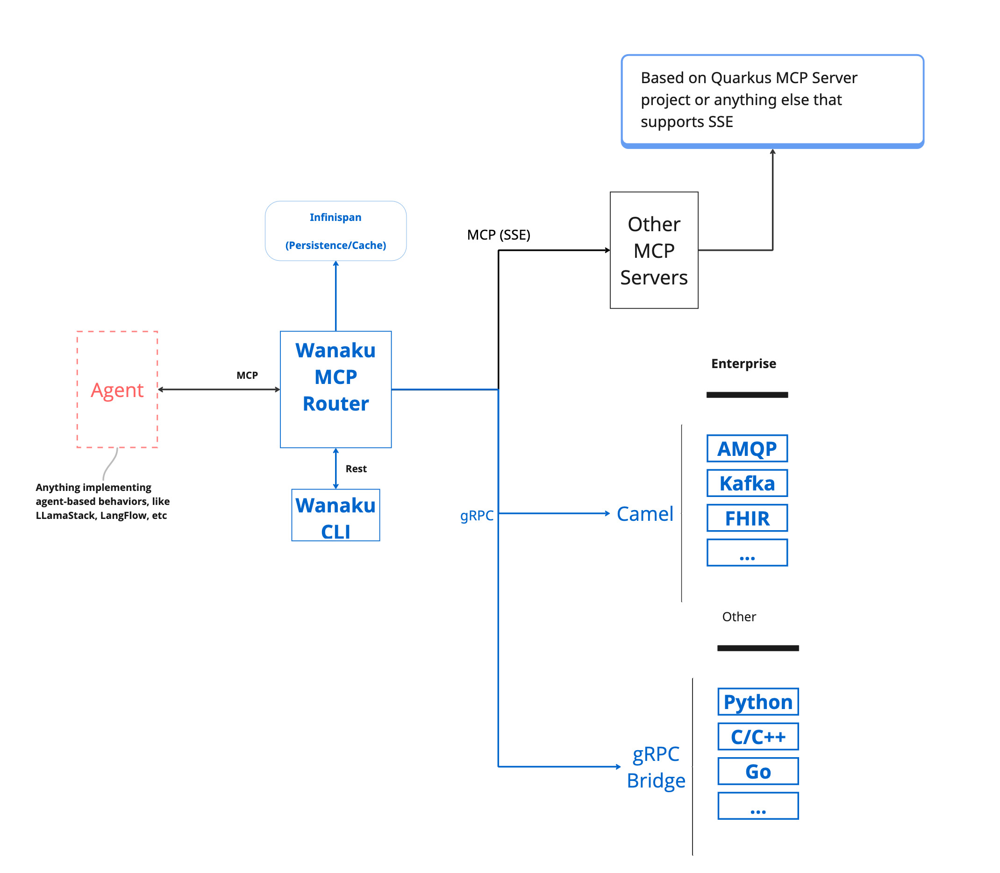

# Getting Started with Wanaku

## Introduction

Wanaku aims to provide unified access, routing and resource management capabilities for your organization and your AI Agents.

## What Is Wanaku?

The Wanaku MCP Router is an integration service designed to securely connect AI agents with various enterprise systems and cloud services. It acts as a central hub that manages and governs how agents access specific resources and tools, effectively proxying and filtering capabilities exposed to Large Language Models (LLMs).

The Wanaku MCP Router itself does not directly host tools or resources; instead, it acts as an integration service that connects AI agents with external resources and tools, including enterprise systems and cloud services. It manages and governs access between agent types and specific resources, proxying and filtering available capabilities to agents and their LLM.

### Key Components

Wanaku provides specialized services, referred to as "capabilities" that offer specific functionalities to the Wanaku MCP Router.

These capabilities enable communication with various systems, such as:
- Kafka services and message brokers
- Cloud services (AWS, Azure, Google Cloud, etc.)
- Databases (SQL, NoSQL, etc.)
- Enterprise systems (Workday, Salesforce, SAP, etc.)
- File systems and storage services
- HTTP/REST APIs

### MCP-to-MCP Bridge

Furthermore, Wanaku features an MCP-to-MCP bridge, which allows it to act as a centralized gateway or proxy for other MCP servers that use HTTP as the transport mechanism. This capability enables Wanaku to aggregate and effectively "hide" multiple external MCP servers, simplifying management and increasing the overall functionality of a Wanaku instance.

### Open Source

Wanaku is an open-source project and is licensed under Apache 2.0.

## Meet Wanaku

If you haven't seen it already, we recommend watching the Getting Started with Wanaku video that introduces the project and how it works.

> [!NOTE]
> Also check the Getting Started from the [demos repository](https://github.com/wanaku-ai/wanaku-demos/tree/main/01-getting-started).

## How Wanaku Works

Using Wanaku MCP Router involves three key actions:

### 1. Adding Tools or Resources

Adding tools and resources to the Wanaku MCP Router expands the functionality available to agents using Wanaku.

* **MCP Tools** equip an agent with capabilities not inherently present in its native models
* **MCP Resources** allow an AI agent to consume data—such as files or records—and inject additional information into its context

Both tools and resources depend on capabilities that can be dynamically added to or removed from the Wanaku MCP Router. Once these capabilities are integrated, either through downstream services or by connecting to other MCP servers, users can then incorporate new tools and resources into Wanaku. These additions can then leverage the newly integrated capabilities to interact with enterprise systems and cloud services.

### 2. Forwarding Other MCP Servers

Wanaku can act as a central gateway or proxy to other MCP servers that use HTTP as the transport mechanism. This feature allows for a centralized endpoint to aggregate tools and resources provided by other MCP servers, making them accessible as if they were local to the Wanaku instance.

### 3. Adding New Capabilities

This refers to extending the router's functionality by integrating with various external systems.

Wanaku leverages Quarkus and Apache Camel to provide connectivity to a vast range of services and platforms. This allows users to create custom services to solve particular needs. These services can be implemented in any language that supports gRPC for communication with the Wanaku MCP Router.

> [!NOTE]
> It is also possible to create and run services in Java and other languages, such as Go or Python, although the process is not entirely documented at the moment.

## Quick Start Checklist

Ready to get started? Follow these steps:

1. **[Install and Setup](installation.md)**
   - Set up Keycloak for authentication
   - Install the Wanaku CLI
   - Deploy the router backend
   - Install capability services

2. **[Configure Security](security.md)**
   - Configure authentication
   - Set up OIDC integration
   - Manage access control

3. **[Add Tools and Resources](managing-tools.md)**
   - Register tools with the router
   - Expose resources to AI agents
   - Configure capability services

4. **[Connect Your AI Client](client-integration.md)**
   - Configure Claude Desktop, HyperChat, or other MCP clients
   - Test the connection
   - Start using tools and resources

## Next Steps

- **Installation**: Follow the [Installation Guide](installation.md) to set up Wanaku
- **Architecture**: Learn about Wanaku's [architecture and design](architecture.md)
- **Managing Tools**: See [Managing Tools](managing-tools.md) for adding and configuring tools
- **Extending Wanaku**: Learn how to [create custom capabilities](extending-wanaku.md)
- **Troubleshooting**: Check the [Troubleshooting Guide](troubleshooting.md) if you encounter issues

## Documentation Structure

The Wanaku documentation is organized into the following guides:

| Guide | Purpose | Audience |
|-------|---------|----------|
| [Getting Started](getting-started.md) | Introduction and overview | Everyone |
| [Installation](installation.md) | Installing and deploying Wanaku | Operators, Developers |
| [Security](security.md) | Authentication and authorization | Operators, Security teams |
| [Managing Tools](managing-tools.md) | Working with MCP tools | Users, Developers |
| [Managing Resources](managing-resources.md) | Working with resources and prompts | Users, Developers |
| [Advanced Usage](advanced-usage.md) | Namespaces, forwards, URIs | Advanced users |
| [Extending Wanaku](extending-wanaku.md) | Creating custom capabilities | Developers |
| [Client Integration](client-integration.md) | Connecting MCP clients | Users, Developers |
| [Troubleshooting](troubleshooting.md) | Solving common problems | Everyone |
| [Architecture](architecture.md) | System design and components | Architects, Developers |
| [Configuration](configurations.md) | Configuration reference | Operators, Developers |

## Getting Help

If you need help:

- Check the [FAQ](faq.md) for common questions
- Review the [Troubleshooting Guide](troubleshooting.md)
- Search [GitHub Issues](https://github.com/wanaku-ai/wanaku/issues)
- Ask in [GitHub Discussions](https://github.com/wanaku-ai/wanaku/discussions)
- Read the [Contributing Guide](../CONTRIBUTING.md) to contribute

Welcome to Wanaku!
