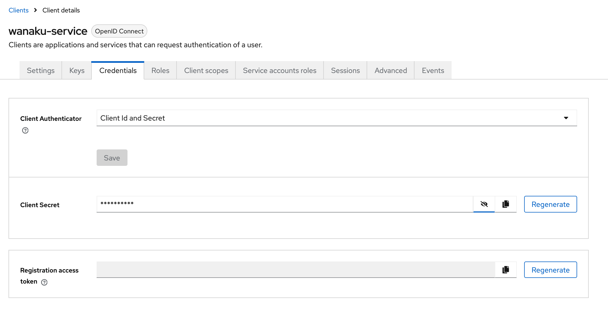

# Installing Wanaku

This guide covers installing and setting up Wanaku, including Keycloak authentication, the CLI, router backend, and capability services.

## Prerequisites

Before installing Wanaku, ensure you have:

- **For Local Development:**
  - Podman or Docker
  - Java 17+ (for running from JAR)
  - Internet connection for downloading components

- **For Kubernetes/OpenShift Deployment:**
  - Access to a Kubernetes or OpenShift cluster
  - `kubectl` or `oc` CLI tools
  - `helm` CLI tool (version 3.x or later)
  - Sufficient permissions to create namespaces and deployments

## Installation Overview

Wanaku installation involves several components:

1. **Keycloak** - Authentication and authorization
2. **Wanaku CLI** - Command-line management tool
3. **Router Backend** - Core MCP server
4. **Capability Services** - Tool and resource providers

## Step 1: Installing Keycloak

Security in Wanaku involves controlling access to the management APIs and web interface while ensuring that only authorized users can modify tools, resources, and configurations. Wanaku also ensures secure access to the MCP tools and resources.

Wanaku uses [Keycloak](https://keycloak.org) for authentication and authorization. A Keycloak instance must be running for Wanaku to work. This section covers the basics of getting Keycloak ready for Wanaku for development and production purposes.

### Keycloak Setup for Wanaku

Choose the setup that matches your environment:

* **Local Development:** Use Podman for a quick, local instance
* **OpenShift Deployment:** Follow these steps for a cluster environment

### Option 1: Local Setup with Podman

This method is ideal for development and testing on your local machine.

#### Starting the Keycloak Container

First, run the following command in your terminal to start a Keycloak container. This command also sets the initial admin credentials and maps a local volume for data persistence.

```shell
podman run -d \
  -p 127.0.0.1:8543:8080 \
  -e KC_BOOTSTRAP_ADMIN_USERNAME=admin \
  -e KC_BOOTSTRAP_ADMIN_PASSWORD=admin \
  -v keycloak-dev:/opt/keycloak/data \
  quay.io/keycloak/keycloak:26.3.5 start-dev
```

**Options explained:**

* `-p 127.0.0.1:8543:8080`: Maps port `8543` on your local machine to the container's port `8080`. By default, Wanaku expects Keycloak on port `8543`.
* `-e ...`: Sets the default **admin** username and password. Change the password for any non-trivial use case.
* `-v keycloak-dev...`: Creates a persistent volume named `keycloak-dev` to store Keycloak data.

### Option 2: Deploying to OpenShift or Kubernetes

If you are deploying Wanaku in OpenShift or Kubernetes, you can follow these steps to get an entirely new Keycloak setup up and running. If you already have a Keycloak instance, you may skip the deployment section and jump to importing the realm.

#### Deploying Keycloak

Apply the pre-defined Kubernetes configurations located in the [`deploy/auth`](https://github.com/wanaku-ai/wanaku/tree/main/deploy/auth) directory. This will create all the necessary resources for Keycloak to run.

> [!IMPORTANT]
> Before applying, review the files and be sure to change the default admin password for security.

```shell
oc apply -f deploy/auth
```

### Importing the Wanaku Realm Configuration

#### Via CLI (Recommended)

Next, you'll use Keycloak's Admin API to automatically configure the `wanaku` realm. Wanaku comes with a [script that simplifies importing](https://github.com/wanaku-ai/wanaku/blob/main/deploy/auth/configure-auth.sh) the realm configuration into Keycloak.

To run that script:
- Set the `WANAKU_KEYCLOAK_PASS` variable to the admin password of your Keycloak instance
- Set `WANAKU_KEYCLOAK_HOST` to the address of your Keycloak instance (i.e., `localhost` if using Podman or the result of `oc get routes keycloak -o json | jq -r .spec.host` if using OpenShift)

#### Via Keycloak UI

Alternatively, you may also import the configuration using Keycloak's UI, and then proceed to regenerate the capabilities' client secret.

#### Regenerating the Capabilities' Client Secret

Finally, for security, you must regenerate the client secret for the `wanaku-service` client.

1. Navigate to the Keycloak Admin Console at `http://localhost:8543`
2. Log in with your admin credentials (**admin**/**admin**)
3. Select the **wanaku** realm from the dropdown in the top-left corner
4. Go to **Clients** in the side menu and click on **wanaku-service**
5. Go to the **Credentials** tab
6. Click the **Regenerate secret** button and confirm. Copy the new secret to use in your application's configuration



## Step 2: Installing the Wanaku CLI

Although the router comes with a UI, the CLI is the primary method used to manage the router. As such, it's recommended to have it installed.

### Method 1: Installing via Binary Download (Recommended)

The most recommended method for installing the Wanaku CLI is to download the latest version directly from the [releases](https://github.com/wanaku-ai/wanaku/releases) page on GitHub.

1. Go to the [releases page](https://github.com/wanaku-ai/wanaku/releases)
2. Download the appropriate binary for your platform
3. Extract the archive
4. Move the `wanaku` binary to a directory in your PATH

### Method 2: Installing via JBang

To simplify using the Wanaku Command Line Interface (CLI), you can install it via [JBang](https://www.jbang.dev/).

First, ensure JBang is installed on your system. You can find detailed [download and installation](https://www.jbang.dev/download/) instructions on the official JBang website.

After installing JBang, verify it's working correctly by opening your command shell and running:

```shell
jbang version
```

This command should display the installed version of JBang.

Next, to access the Wanaku CLI, install it using JBang with the following command:

```shell
jbang app install wanaku@wanaku-ai/wanaku
```

This will install Wanaku CLI as the `wanaku` command within JBang, meaning that you can run Wanaku from the command line by just executing `wanaku`.

> [!NOTE]
> It requires access to the internet. In case of using a proxy, please ensure that the proxy is configured for your system.
> If Wanaku JBang is not working with your current configuration, please look to [Proxy configuration in JBang documentation](https://www.jbang.dev/documentation/jbang/latest/configuration.html#proxy-configuration).

### Verifying the Installation

After installation, verify the CLI is working:

```shell
wanaku --version
```

## Step 3: Installing and Running the Router

There are three ways to run the router. They work similarly, with the distinction that some of them may come with more capabilities by default.

> [!IMPORTANT]
> Before the router can be executed, it needs to be configured for secure access and control of its resources. Make sure you read the [Security Guide](security.md) **before** running or deploying the router.

### Option 1: Local Development with "wanaku start local"

You can use the Wanaku CLI to start a simplified local instance. To do so, you need to run and configure a local Keycloak instance and then use the `wanaku start local` command to run Wanaku pointing to that instance.

After downloading the CLI and setting up Keycloak, simply run `wanaku start local`. The CLI will download, deploy and start Wanaku with the main server, a file provider and an HTTP provider. You will need to pass the client secret configured so that the capabilities can connect to the router.

```shell
wanaku start local --capabilities-client-secret=aBqsU3EzUPCHumf9sTK5sanxXkB0yFtv
```

If successful, open your browser at http://localhost:8080, and you should have access to the UI.

> [!NOTE]
> You can use the command line to enable more services by using the `--services` option. Use `--help` to see the details.

### Option 2: Kubernetes/OpenShift with Wanaku Operator (Recommended for Production)

The Wanaku Operator simplifies the deployment and management of Wanaku instances on Kubernetes and OpenShift clusters. It automates the creation and configuration of all necessary resources, making it the recommended approach for production deployments.

#### Prerequisites

Before deploying the Wanaku Operator, ensure you have:
- Access to a Kubernetes or OpenShift cluster
- `kubectl` or `oc` CLI tools installed and configured
- `helm` CLI tool installed (version 3.x or later)
- A running Keycloak instance (see Step 1)
- Sufficient permissions to create namespaces, deployments, and custom resources

#### Installing the Wanaku Operator with Helm

The Wanaku Operator can be deployed using Helm charts. First, ensure you're in the correct namespace or create a new one:

```shell
kubectl create namespace wanaku
```

Then, install the operator using the [Helm chart](https://github.com/wanaku-ai/wanaku/tree/main/wanaku-operator/deploy/helm) from the repository:

```shell
helm install wanaku-operator ./wanaku-operator/deploy/helm/wanaku-operator \
  --namespace wanaku \
  --set operatorNamespace=wanaku
```

By default, the operator will be deployed in the namespace specified by the `operatorNamespace` value. You can customize this during installation:

```shell
helm install wanaku-operator ./wanaku-operator/deploy/helm/wanaku-operator \
  --namespace my-custom-namespace \
  --set operatorNamespace=my-custom-namespace
```

To verify the operator is running:

```shell
kubectl get pods -n wanaku
```

You should see the operator pod in a Running state.

#### Creating a Wanaku Instance

Once the operator is installed, you can create Wanaku router instances by defining a custom resource. The operator watches for these custom resources and automatically creates all necessary Kubernetes objects.

Create a file named `wanaku-instance.yaml`:

```yaml
apiVersion: "wanaku.ai/v1alpha1"
kind: Wanaku
metadata:
  name: wanaku-dev
spec:
  auth:
    # Address of the authorization server
    authServer: http://keycloak:8080
  secrets:
    # OIDC credentials secret for the services
    oidcCredentialsSecret: your-keycloak-client-secret

  # Router settings (optional)
  router:
    # Custom image (optional)
    # image: quay.io/wanaku/wanaku-router-backend:latest
    env:
      # Environment variables for the router
      # - name: ENVIRONMENT_VARIABLE_1
      #   value: value1

  # Define the capabilities you want to enable
  capabilities:
    # HTTP capability for HTTP-based tools
    - name: wanaku-http
      image: quay.io/wanaku/wanaku-tool-service-http:latest

    # Camel Integration Capability example
    - name: employee-system
      type: camel-integration-capability
      image: quay.io/wanaku/camel-integration-capability:latest
      env:
        - name: ROUTES_PATH
          value: "/data/employee-routes.camel.yaml"
```

Apply the configuration:

```shell
kubectl apply -f wanaku-instance.yaml
```

Monitor the deployment:

```shell
kubectl get pods -n wanaku
kubectl logs -n wanaku -l app=wanaku-router
```

### Option 3: Manual Kubernetes/OpenShift Deployment

For more control over the deployment, you can use Kustomize templates provided in the repository.

1. Download the kustomize template files from the [`deploy` directory](https://github.com/wanaku-ai/wanaku/tree/main/deploy/openshift/kustomize)
2. Copy the files from the [`dev`](https://github.com/wanaku-ai/wanaku/tree/main/deploy/openshift/kustomize/overlays/dev) directory and create a new overlay (e.g., `prod`)
3. Adjust the kustomize files according to your environment

> [!TIP]
> You may also consult [developer-specific documentation](https://github.com/wanaku-ai/wanaku/blob/main/deploy/openshift/kustomize/CONFIGMAP-USAGE.md) if you need special customizations to your deployment.

### Accessing the Router

Once the router is deployed, you can access:

- **Web UI**: `http://localhost:8080` (local) or your cluster's ingress URL
- **MCP Endpoint (SSE)**: `http://localhost:8080/mcp/sse`
- **MCP Endpoint (HTTP)**: `http://localhost:8080/mcp/`
- **Management API**: `http://localhost:8080/api/`

## Step 4: Installing Capability Services

Capabilities are standalone services that connect to the Wanaku router to provide new functionalities.

### Downloading Capabilities

You can download capability services from the [releases page](https://github.com/wanaku-ai/wanaku/releases). Each release includes several capability services packaged as executable JARs or container images.

### Configuring Capabilities

Before running a capability service, configure it to connect to your router backend:

1. **Service Registration**: Configure the router's address:
   ```properties
   wanaku.service.registration.uri=http://localhost:8080
   ```

2. **Authentication**: Set the OIDC credentials (use the secret from Keycloak):
   ```properties
   quarkus.oidc-client.auth-server-url=http://localhost:8543/realms/wanaku
   quarkus.oidc-client.client-id=wanaku-service
   quarkus.oidc-client.credentials.secret=your-keycloak-secret
   ```

3. **Announcement Address** (if needed): If the auto-detected address is incorrect:
   ```properties
   wanaku.service.registration.announce-address=your-public-address
   ```

> [!TIP]
> You can check the full set of [configuration options](configurations.md) available.

### Running a Capability

Once configured, run the capability from the command line:

```shell
java -jar wanaku-tool-service-http.jar \
  -Dwanaku.service.registration.uri=http://localhost:8080 \
  -Dquarkus.oidc-client.credentials.secret=your-secret
```

Or using environment variables:

```shell
WANAKU_SERVICE_REGISTRATION_URI=http://localhost:8080 \
QUARKUS_OIDC_CLIENT_CREDENTIALS_SECRET=your-secret \
java -jar wanaku-tool-service-http.jar
```

### Verifying Capability Registration

Check that the capability registered successfully:

```shell
wanaku capabilities list
```

You should see your capability in the list with an "online" status.

## Step 5: Shell Completion (Optional)

Wanaku provides shell completion support for bash and zsh, enabling tab-completion for all commands, subcommands, and their options.

### Quick Setup for Current Session

Enable completion for just your current terminal session:

```shell
# One-liner for bash or zsh
source <(wanaku completion generate)

# Alternative using eval
eval "$(wanaku completion generate)"
```

### Permanent Installation

#### For Bash on Linux

```shell
wanaku completion generate --output ~/.wanaku_completion
echo "source ~/.wanaku_completion" >> ~/.bashrc
source ~/.bashrc
```

#### For Zsh on Linux/macOS

```shell
mkdir -p ~/.zsh/completions
wanaku completion generate --output ~/.zsh/completions/_wanaku
echo "autoload -U +X bashcompinit && bashcompinit" >> ~/.zshrc
echo "source ~/.zsh/completions/_wanaku" >> ~/.zshrc
source ~/.zshrc
```

### Using Shell Completion

Once installed, use tab-completion with the Wanaku CLI:

```shell
# Tab-complete commands
wanaku <TAB>
# Shows: capabilities, completion, forwards, namespaces, resources, tools, etc.

# Tab-complete subcommands
wanaku namespaces <TAB>
# Shows: label, list

# Tab-complete options
wanaku tools add --<TAB>
# Shows: --description, --help, --name, --namespace, --uri, etc.
```

## Next Steps

Now that Wanaku is installed, you can:

1. **[Configure Security](security.md)** - Set up authentication and access control
2. **[Add Tools](managing-tools.md)** - Register tools with the router
3. **[Add Resources](managing-resources.md)** - Expose resources to AI agents
4. **[Connect Clients](client-integration.md)** - Integrate with Claude, HyperChat, etc.
5. **[Extend Wanaku](extending-wanaku.md)** - Create custom capabilities

## Troubleshooting

If you encounter issues during installation:

- **Keycloak won't start**: Check port 8543 is not already in use
- **CLI not found**: Ensure the binary is in your PATH
- **Router won't start**: Verify Keycloak is running and accessible
- **Capabilities won't register**: Check OIDC credentials and network connectivity

See the [Troubleshooting Guide](troubleshooting.md) for more detailed solutions.

## Related Documentation

- [Security Guide](security.md) - Authentication and authorization
- [Configuration Reference](configurations.md) - All configuration options
- [Architecture](architecture.md) - System design and components
- [Getting Started](getting-started.md) - Overview and introduction
