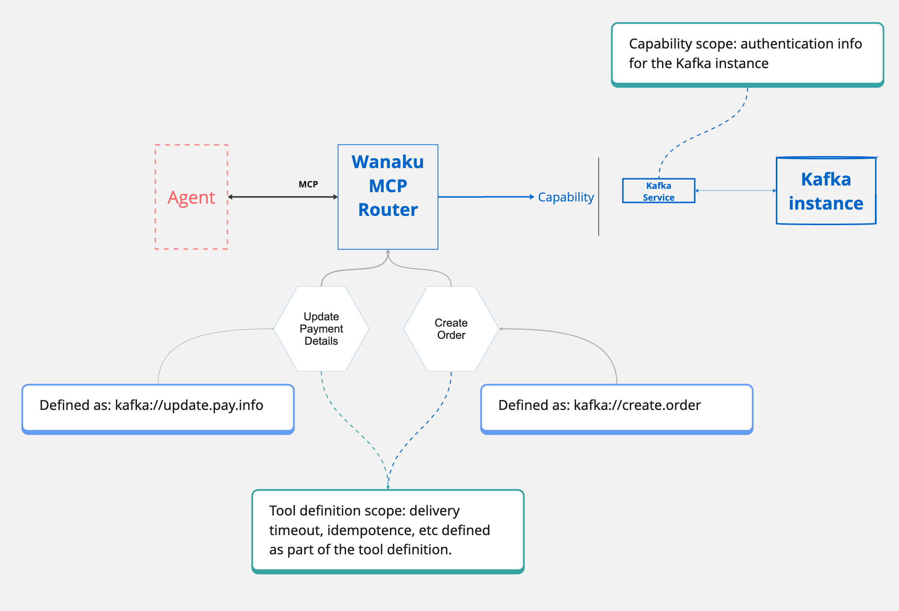
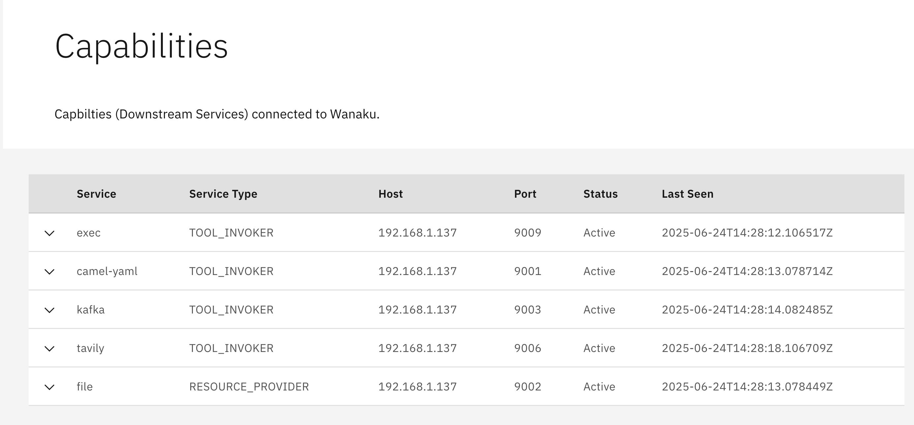

# Managing Tools

This guide covers how to work with MCP tools in Wanaku, including understanding capabilities, adding tools, organizing them with labels, and generating tools from OpenAPI specifications.

## Overview

An MCP (Model Context Protocol) tool enables Large Language Models (LLMs) to execute tasks beyond their inherent capabilities by using external functions. Each tool is uniquely identified by a name and defined with an input schema that outlines the expected parameters.

Essentially, MCP tools act as a standardized interface through which an AI agent can request information or execute specific tasks from external systems, like APIs or databases.

When adding a tool to Wanaku, there are two key considerations:

1. **Capability**: Determine which capability will handle the request and process the input data
2. **Tool/Service Arguments**: Identify any arguments (also known as properties) that the tool and/or service accept

A capability service is required to be available at the moment when a new tool is being added to Wanaku MCP Router.

## Understanding Capabilities

Wanaku itself does not have any builtin MCP tool, resource or functionality itself. The router itself is just a blank MCP server.

To actually perform its work, Wanaku relies on specialized services that offer the connectivity bridge that enables Wanaku to talk to any kind of service. At its core, Wanaku is powered by [Quarkus](https://quarkus.io/) and [Apache Camel](https://camel.apache.org), which provide the ability to connect to more than [300 different types of systems and services](https://camel.apache.org/components/latest/).

The power of Wanaku relies on its ability to plug in different types of systems, regardless of them being new microservices or legacy enterprise systems. For instance, consider the scenario of an enterprise organization, which is running hundreds of systems. With Wanaku, it is possible to create a specific capability for each of them (i.e.: a capability for the finance systems, another for human resources, another for billing, and so on).

The granularity on which these capabilities can operate is a decision left to the administrator of the system. For some organizations, having a "Kafka" capability to Wanaku capable of talking to any of its systems may be enough. Others, may want to have system-specific ones (i.e.: a billing capability, an employee system capability, etc).

The recommended way to create those capabilities is to use the [Camel Integration Capability for Wanaku](https://wanaku.ai/docs/camel-integration-capability/). This is a subcomponent of Wanaku that leverages Apache Camel to exchange data with any system that Camel is capable of talking to.



> [!NOTE]
> Capabilities were, at some point, also called "Downstream services" or "targets". You may still see that terminology used in some places, especially in older documentation.

### Viewing Available Capabilities

You should see a list of capabilities available in the UI, in the Capabilities page. Something similar to this:



On the CLI, running `wanaku capabilities list` lists the capabilities available for MCP tools:

```shell
service serviceType  host      port status lastSeen
exec    tool-invoker 127.0.0.1 9009 active Sat, Oct 18, 2025 at 18:47:22
http    tool-invoker 127.0.0.1 9000 active Sat, Oct 18, 2025 at 18:47:23
tavily  tool-invoker 127.0.0.1 9006 active Sat, Oct 18, 2025 at 18:47:23
```

Capabilities determine what type of tools you may add to the router. As such, in the output from the CLI above, it means that this server can add tools of the following types: `exec`, `tavily`, and `http`.

### Capability Service Types

Wanaku accepts the following capability service types:

* **`tool-invoker`**: These capabilities can be used to create MCP tools
* **`resource-provider`**: These capabilities can be used to create MCP resources
* **`multi-capability`**: These capabilities can be used to create either MCP tools or MCP resources

## Adding Tools Using the CLI

To add a new tool to a Wanaku MCP Router Backend instance running locally on http://localhost:8080, use the following command:

```shell
wanaku tools add -n "meow-facts" --description "Retrieve random facts about cats" --uri "https://meowfacts.herokuapp.com?count={parameter.valueOrElse('count', 1)}" --type http --property "count:int,The count of facts to retrieve" --required count
```

The command `wanaku tools add` is used to register a new tool with the Wanaku MCP Router. Let's break down each part of the command:

* `-n "meow-facts"`: This flag sets the name of the tool to "meow-facts". This is a unique, human-readable identifier for the tool
* `--description "Retrieve random facts about cats"`: This provides a description of what the tool does, making it clear for users and LLMs
* `--uri "https://meowfacts.herokuapp.com?count={parameter.valueOrElse('count', 1)}"`: This specifies the URI (Uniform Resource Identifier) that the tool will interact with. In this case, it's an HTTP endpoint that provides cat facts. The `{parameter.valueOrElse('count', 1)}` part indicates that the count parameter from the tool's input will be used in the URI. If count is not provided, it will default to 1. This demonstrates how Wanaku can dynamically build URIs with parameters
* `--type http`: This defines the type of the tool's underlying service, which in this case is `http`. This tells Wanaku that it should use its HTTP service handling capabilities for this tool
* `--property "count:int,The count of facts to retrieve"`: This defines an input property for the tool named count. It specifies that count is an integer (int) and provides a description of what it represents: `"The count of facts to retrieve"`
* `--required count`: This flag indicates that the count property is a required input for this tool

> [!NOTE]
> For remote instances, you can use the parameter `--host` to point to the location of the instance.

> [!IMPORTANT]
> The meaning of the `uri` and how to actually compose it, depends on the type of capability being used. Each capability describes exactly the meaning of the URI, so make sure to check the capability service for details. For more information, see the [Advanced Usage Guide](advanced-usage.md#understanding-uris).

## Adding Tools Using the UI

It is also possible to add new tools using the UI, by accessing the Tools page and filling the form.


## Organizing Tools with Labels

You can organize and categorize your tools using labels. Labels are key-value pairs that help you filter and manage tools more effectively.

### Adding Labels When Creating Tools

```shell
wanaku tools add -n "weather-api" --description "Get weather forecast" --uri "https://api.weather.com/forecast" --type http --label category=weather --label environment=production --label region=us-east
```

Labels can be used for:
- **Categorization**: Group tools by function (e.g., `category=weather`, `category=finance`)
- **Environment tracking**: Identify deployment environments (e.g., `environment=production`, `environment=staging`)
- **Access control**: Tag tools by team or department (e.g., `team=engineering`, `team=sales`)
- **Lifecycle management**: Mark tools for deprecation or testing (e.g., `status=deprecated`, `status=beta`)

You can add multiple labels by repeating the `--label` flag, using the format `--label key=value`.

### Managing Labels on Existing Tools

After creating tools, you can add or remove labels without modifying the tool definition:

**Adding labels to an existing tool:**
```shell
# Add labels to a specific tool
wanaku tools label add --name "weather-api" --label priority=high --label reviewed=true

# Add labels to multiple tools using label expressions (-e is short for --label-expression)
wanaku tools label add -e 'category=weather' --label migrated=true
```

**Removing labels from an existing tool:**
```shell
# Remove labels from a specific tool
wanaku tools label remove --name "weather-api" --label temporary --label draft

# Remove labels from multiple tools using label expressions (-e is short for --label-expression)
wanaku tools label remove -e 'status=deprecated' --label legacy
```

**Note:** When adding a label with a key that already exists, the value will be updated. When removing a non-existent label, it will be silently ignored.

## Configuring Tool Capabilities

Sometimes, specific configurations are required for the downstream services (capabilities) that a tool uses. This might include setting timeouts for operations or providing credentials to access a particular resource.

In such scenarios, you can associate configuration and secret files directly with a tool. These files will be automatically used by the underlying capabilities each time the tool is invoked.

Here's an example of how to add a tool and link it to configuration and secret files:

```shell
wanaku tools add --host http://localhost:8080 -n "meow-facts" --description "Retrieve random facts about cats" --uri "https://meowfacts.herokuapp.com?count={count or 1}" --type http --property "count:int,The count of facts to retrieve" --required count --configuration-from-file capabilities.properties --secrets-from-file secret.properties
```

In this command:

* `--configuration-from-file capabilities.properties`: This flag specifies a file named `capabilities.properties` that contains configuration settings to be passed to the underlying capability whenever the `"meow-facts"` tool is used
* `--secrets-from-file secret.properties`: This flag points to a file named `secret.properties` that holds sensitive information (like API keys or passwords) needed by the capability to access resources, ensuring secure handling of credentials

Some capabilities within Wanaku are designed to interpret these configuration settings to dynamically adjust how they interact with external systems. For instance, Camel-based capabilities leverage these settings, particularly those prefixed with `query.`, to modify the Camel URI used for the endpoint.

Consider the following example in a configuration file:

```properties
key=value
query.addKey=addedValue
```

In this scenario, a Camel-based capability would automatically append `addKey=addValue` to the URI passed to the underlying Camel producer. This allows for flexible and dynamic adjustment of endpoint parameters based on the provided configuration.

Secrets behave just as similarly, but are adapted by the capabilities for secure handling of the data.

## Importing ToolSets

Wanaku ToolSets are collections of tools that can be easily shared and imported into your Wanaku router. This feature allows for convenient distribution of pre-configured tools among users.

Wanaku provides a [selection of ready-to-use ToolSets](https://github.com/wanaku-ai/wanaku-toolsets) that you can import to quickly get started and explore its functionalities.

To import a ToolSet directly into your router from a URL, use the following command:

```shell
wanaku tools import https://raw.githubusercontent.com/wanaku-ai/wanaku-toolsets/refs/heads/main/toolsets/currency.json
```

If you have a ToolSet definition file already stored on your local machine, you can import it using its file path:

```shell
wanaku tools import /path/to/the/toolsets/currency.json
```

## Viewing Tools

You can check what tools are available in a Wanaku MCP Router instance by running:

```shell
wanaku tools list
```

For example, you should receive an output similar to this:

```shell
Name               Type               URI
meow-facts      => http            => https://meowfacts.herokuapp.com?count={parameter.valueOrElse('count', 1)}
dog-facts       => http            => https://dogapi.dog/api/v2/facts?limit={parameter.valueOrElse('count', 1)}
```

Any available tool is also listed by default when you access the UI.

## Editing Tools

The `wanaku tools edit` command enables you to modify the existing definition of a tool that is registered with your Wanaku MCP Router. This command provides a convenient way to update a tool's JSON definition directly within your terminal using the `nano` text editor.

```shell
wanaku tools edit [options] [toolName]
```

In this command:

* `toolName`: (Optional) Specifies the exact name of the tool you wish to modify. If this argument is omitted, the command will present you with an interactive, scrollable list of all currently registered tools, allowing for easy selection

### Editing a Specific Tool

If you know the precise name of the tool you want to edit, you can specify it directly. For example, to edit a tool named "my-custom-tool":

```shell
wanaku tools edit my-custom-tool
```

Upon executing this command, Wanaku will fetch the JSON definition of `"my-custom-tool"` and open it in the nano editor within your terminal. After making your desired changes, save them (usually by pressing `Ctrl+S`) and then exit nano (`Ctrl+X`). Wanaku will then ask for your confirmation before applying the updates to the tool's definition.

### Interactive Tool Selection

When you're unsure of the exact tool name or want to browse available tools, run the edit command without specifying a toolName:

```shell
wanaku tools edit
```

This will present an interactive, scrollable list of all your registered tools. Use your keyboard's arrow keys to navigate and highlight the tool you wish to edit, then press Enter. The selected tool's JSON definition will then open in nano for you to make your modifications.

## Removing Tools

Tools can be removed from the UI by clicking on the Trash icon, or via the CLI using the `wanaku tools remove` command.

### Removing a Single Tool by Name

To remove a specific tool by name:

```shell
wanaku tools remove --name "meow-facts"
```

### Batch Removal Using Label Expressions

You can remove multiple tools at once using label expressions. This is particularly useful for cleaning up tools by category, environment, or other criteria:

```shell
wanaku tools remove -e 'category=weather'
```

This command will:
1. Find all tools with the label `category=weather`
2. Display a preview table showing which tools will be removed
3. Prompt for confirmation before removal
4. Report the number of tools removed

**Advanced Label Expression Examples:**

Remove all non-production tools:
```shell
wanaku tools remove -e 'environment!=production'
```

Remove deprecated weather tools:
```shell
wanaku tools remove -e 'category=weather & status=deprecated'
```

Remove tools from either development or staging environments:
```shell
wanaku tools remove -e 'environment=development | environment=staging'
```

Remove deprecated tools in multiple categories:
```shell
wanaku tools remove -e '(category=weather | category=news) & status=deprecated'
```

**Label Expression Syntax:**
- `key=value` - Equals
- `key!=value` - Not equals
- `expr1 & expr2` - Logical AND
- `expr1 | expr2` - Logical OR
- `!expr` - Logical NOT
- `(expr)` - Grouping

**Skipping Confirmation:**

For automated scripts, you can skip the confirmation prompt using the `--assume-yes` or `-y` flag:

```shell
wanaku tools remove -e 'status=deprecated' -y
```

> [!WARNING]
> Batch removal operations cannot be undone. Always review the preview table carefully before confirming removal.

For detailed information about label expression syntax, see:
```shell
wanaku man label-expression
```

## Generating Tools from OpenAPI

The `wanaku tools generate` command converts an OpenAPI specification into a collection of tool references that can be used by an AI agent.

It parses and resolves OpenAPI paths and operations, transforming them into a standardized tool reference format for HTTP services.

This command accepts an OpenAPI specification file (either as a local path or URL) and produces a JSON output containing tool references. Each operation in the API is converted to a tool reference with appropriate metadata, including the operation's name, description, URI template, and input schema.

The command handles server variable substitution, proper formatting of path parameters according to the tool reference specification.

By default, the command uses the first server defined in the OpenAPI specification, but you can override this behavior by specifying a different server URL or selecting a different server from the specification by index.

The generated output can be directed to standard output or saved to a file.

If the process completes successfully, the command returns exit code `0`. It returns exit code `3` if no paths are found in the specification and exit code `2` if an error occurs during processing.

> [!NOTE]
> The command supports both `json` and `yaml` definition formats.

### Basic Usage

For example:

```shell
wanaku tools generate http://petstore3.swagger.io/api/v3/openapi.yaml
```

### Server Variables

If the spec defines a server url that contains variables:

```yaml
servers:
  - url: 'https://{env}.domain.com/foo/{v1}/{v2}/{v3}'
    variables:
      env:
        description: Environment - staging or production
        default: stage-api
        enum:
          - stage-api
          - api
      # other variables
      # ...
```

Then, you can specify values as command parameters:

```shell
wanaku tools generate --server-variable env=prod --server-variable v1=first http://petstore3.swagger.io/api/v3/openapi.json
```

If not specified for a variable in the server URL template, the default value defined in the OpenAPI specification will be used.

It only applies when using servers from the OpenAPI specification (not when using `--server-url`).

Variables must be defined in the server object of the OpenAPI specification.

Empty or null values for either key or value will be ignored.

### Selecting Server Index

OpenAPI specifications can define multiple server URLs:

```json
{
  "servers": [
    {
      "url": "https://api.example.com/v1",
      "description": "Production server"
    },
    {
      "url": "https://staging-api.example.com/v1",
      "description": "Staging server"
    },
    {
      "url": "http://localhost:8080/v1",
      "description": "Local development server"
    }
  ]
}
```

The `--server-index` (or `-i`) option allows you to specify which server definition from the OpenAPI specification should be used as the base URL for tool references.

```shell
wanaku tools generate -i 1 ./openapi-spec.yaml
```

This option is ignored if `--server-url` is specified, as an explicit URL overrides any server definitions in the specification.

If neither `--server-index` nor `--server-url` is specified, the command will default to using the first server (index `0`) from the specification.

The `--server-index` option can be used together with `--server-variable` when the selected server has variable templates:

```yaml
servers:
  - url: https://{environment}.api.example.com/{version}
    variables:
      environment:
        default: dev
      version:
        default: v1
  - url: https://{environment}.api2.example.com/{version}
    variables:
      environment:
        default: dev
      version:
        default: v1
  - url: https://{environment}.api3.example.com/{version}
    variables:
      environment:
        default: dev
      version:
        default: v1
```

You could select this server and override its variables:

```shell
wanaku tools generate -i 0 -v environment=prod -v version=v2 ./openapi-spec.yaml
```

### Output File Options

The `--output-file` (or `-o`) option specifies the file path where the generated tool references should be written.

It determines where the output JSON containing all the tool references will be saved.

```shell
wanaku tools generate -o ./toolsets/api-tools.json http://petstore3.swagger.io/api/v3/openapi.json
```

If `--output-file` is specified, the command will write the JSON toolset to the specified file path.

If `--output-file` is not specified, the command will write the JSON toolset to standard output (STDOUT).

If the specified path is a directory, the command will write to a file named `out.json` within that directory and provide a warning message.

If the specified file already exists, the command will return an error without overwriting the file. The parent directory of the specified file must exist and be writable by the current user.

### Automatic Import

If the `--import` (or `-I`) option is set, the generated toolset is automatically imported into the router, equivalent to running the generate command followed by the import command.

## Related Documentation

- [Installation Guide](installation.md) - Installing capability services
- [Advanced Usage](advanced-usage.md) - Understanding URIs and request bodies
- [Extending Wanaku](extending-wanaku.md) - Creating custom tool capabilities
- [Configuration Reference](configurations.md) - Capability configuration options
- [Troubleshooting](troubleshooting.md) - Solving tool-related issues
